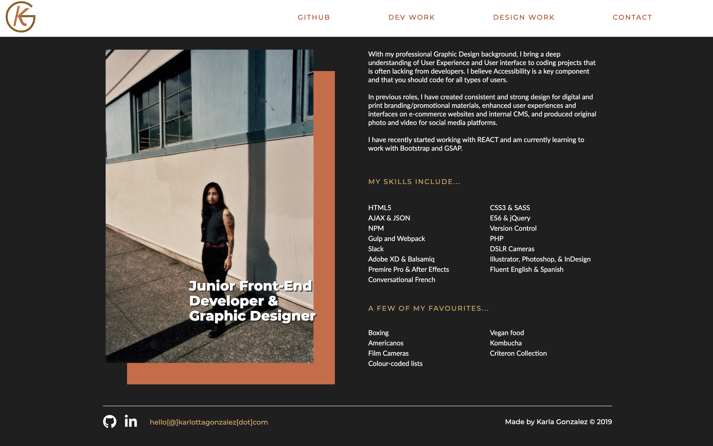

# Portfolio Website

This is a multi-page, responsive portfolio website showcasing Front-End projects and Graphic Design work.

## Built With

- [HTML5](https://developer.mozilla.org/en-US/docs/Web/Guide/HTML/HTML5)

- [CSS3](https://developer.mozilla.org/en-US/docs/Learn/CSS/Introduction_to_CSS)

- [jQuery](https://jquery.com/)

- [PHP](https://developer.wordpress.org/)

## Personal learnings

- Utilizing Javascript to filter out portfolio options
- Working with Web accessibility resources for AA standard goal
- Working with Mail PHP and SHELL users for the first time

## Authors

- [Karla Gonzalez](https://github.com/karlapaulina)
